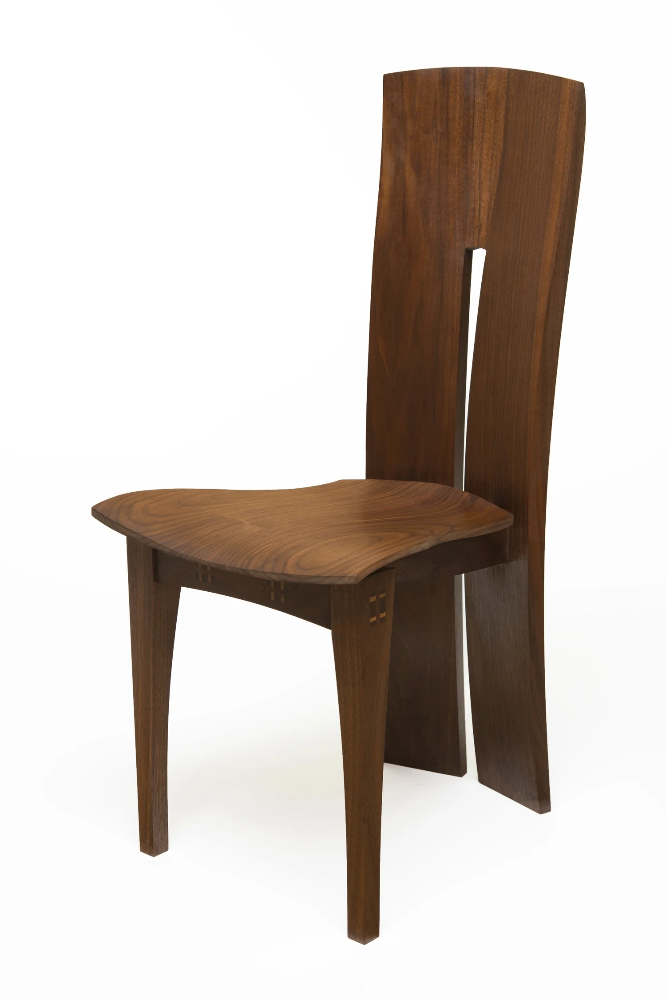

# maxgrossman.com

The website for Max Grossman Designs — furniture designer & maker, West Orange, NJ.

This is a plain static site: one HTML file, one stylesheet, no build step and no
frameworks. It can be hosted for free, so the only recurring cost is the domain
registration itself (roughly $10–15/year instead of ~$200/year on Squarespace).

## Files

| File | What it is |
|---|---|
| `index.html` | The whole homepage — nav, hero, work portfolio, about, shop, contact |
| `styles.css` | Design tokens (colors, fonts, spacing) and all component styles |
| `images/` | Put your photos here (see below) |

## Previewing locally

Just open `index.html` in a browser, or run a tiny server:

```sh
python3 -m http.server 8000
# then visit http://localhost:8000
```

## Adding your photos

The hero, the six work cards, and the about portrait currently show striped
placeholder boxes. Each one has an HTML comment next to it showing the exact
`` tag to swap in. The short version:

1. Drop photos into `images/` (e.g. `hero.jpg`, `portrait.jpg`, `seating.jpg`, …).
2. In `index.html`, replace each `<div class="img-slot">…</div>` with:
   ```html
   
   ```

**Important:** the three shirt photos in the Shop section currently load from
Squarespace's CDN (`images.squarespace-cdn.com`). **Download those images and
move them into `images/` before cancelling Squarespace**, or they will break
when the subscription ends.

## Publishing (free hosting)

Any of these work; GitHub Pages is simplest since the code already lives here:

**GitHub Pages** (recommended)
1. On GitHub: repo **Settings → Pages → Source: Deploy from a branch**, pick the
   main branch, `/ (root)` folder.
2. The site goes live at `https://<username>.github.io/maxgrossman.com/`.
3. To use the real domain: in the same Pages settings, add `maxgrossman.com` as
   the custom domain and enable "Enforce HTTPS".

Alternatives: [Cloudflare Pages](https://pages.cloudflare.com) and
[Netlify](https://netlify.com) — both have free tiers, connect directly to this
GitHub repo, and redeploy automatically on every push.

## Moving the domain off Squarespace

1. In Squarespace: **Settings → Domains → maxgrossman.com → Transfer domain**,
   unlock it and copy the transfer (EPP) code.
2. Start a transfer at a registrar such as Cloudflare Registrar (at-cost,
   ~$10/yr), Porkbun, or Namecheap, and paste the code. Transfers take up to
   5–7 days and add a year of registration.
3. Once transferred, point DNS at your host. For GitHub Pages:
   - `A` records on the apex (`maxgrossman.com`) → `185.199.108.153`,
     `185.199.109.153`, `185.199.110.153`, `185.199.111.153`
   - `CNAME` record on `www` → `<username>.github.io`
4. Keep the site live during the switch: don't cancel the Squarespace plan until
   the new site is up on the domain and the shirt images have been moved over.

Note: email that comes with the domain (e.g. `max@maxgrossman.com` via Google
Workspace or Squarespace email) keeps working as long as the MX records are
copied to the new DNS — check what MX records exist before switching.

## The store

The Shop section is currently a showcase — the cards don't check out. Options
for real purchases without a monthly platform fee, roughly in order of effort:

1. **Stripe Payment Links** — create a link per product in the Stripe dashboard
   and point each shirt card's `href` at it. No monthly fee, ~3% per sale.
2. **Snipcart or a "Buy" button embed** — adds a cart overlay to this static site.
3. **Print-on-demand storefront** (Printful/Printify) — they print and ship the
   shirts; link the cards to that storefront.
